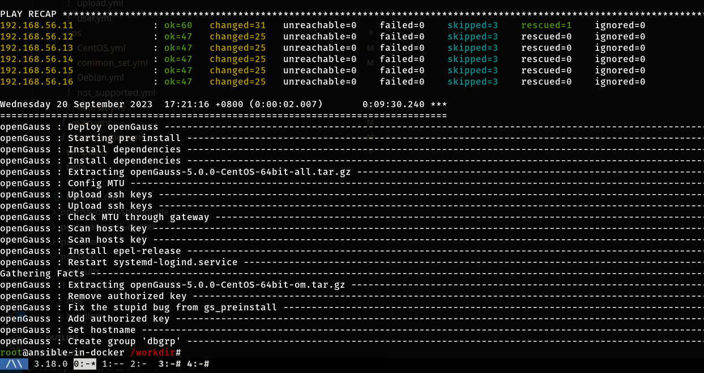

# hosts.ini 示例

master 组仅可以配置 1 台机器。follower 可以多台。cascade 可选可为空。

```
[openGauss_master]
192.168.56.11

[openGauss_follower]
192.168.56.12

[openGauss_cascade]
192.168.56.13

[openGauss:children]
openGauss_master
openGauss_follower
openGauss_cascade
```

# playbook.yml 示例

```
- name: Deploy openGauss database
  hosts: openGauss
  become: true
  roles:
    - openGauss
```

# 效果展示

本地物理机，启动 6 台虚拟机，用时 9 分 30 秒完成 1 主 4 从 1 级联的架构部署。



