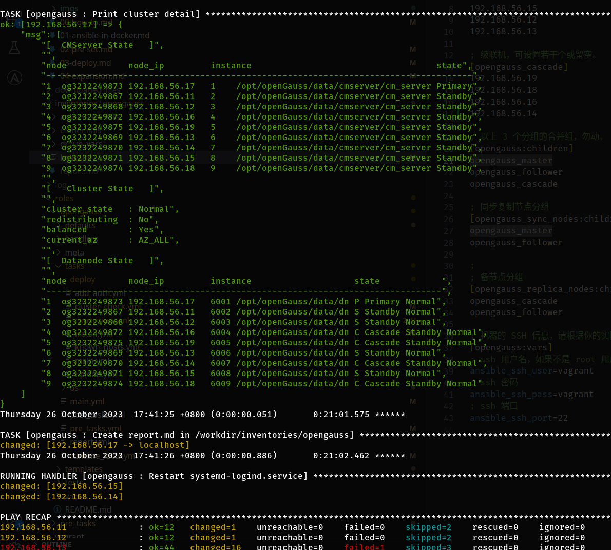

本文内容适合对熟悉 Ansible 的同学看。

如果你对 Ansible 不了解，请看 [创建 Ansible 容器](01-ansible-in-docker.md)，使用 docker 快速搭建一个可以运行本项目的 ansible 环境，降低对操作系统的依赖。

*** 整个说明文档里所提到的文件目录，均以 Ansible 容器环境内为例，不再另外说明。 ***

# hosts.ini 示例

master 组仅可以配置 1 台机器。follower 可以多台。cascade 可选可为空。

```
[opengauss_master]
192.168.56.11

[opengauss_follower]
192.168.56.12

[opengauss_cascade]
192.168.56.13

[opengauss:children]
opengauss_master
opengauss_follower
opengauss_cascade
```

# playbook.yml 示例

```
- name: Deploy openGauss
  hosts: opengauss
  become: true
  become_flags: "-i"
  roles:
    - opengauss
```

# 效果展示

## 物理环境

* Intel(R) Xeon(R) CPU E5-2680 v2 @ 2.80GHz × 2
* 12GB×8, DDR3 1333
* WD40EZAZ-00S 单块 SATA 磁盘

## 虚拟机环境

 * VirtualBox 7.0
 * 4vCPU + 4GB RAM 虚拟机共 9 台
 * openEuler release 20.03 (LTS-SP3)

## 最终部署效果

1 主 2 备 2 级联，耗时 15 分钟（安装包已下载的前提下）。


从上图的架构，扩容为 1 主 4 备 4 级联，耗时 21 分钟。

