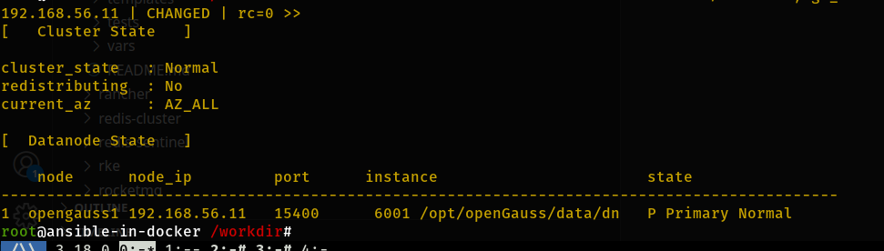
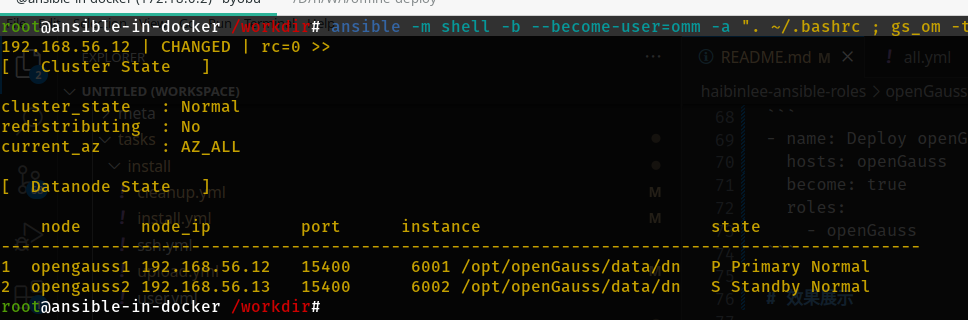
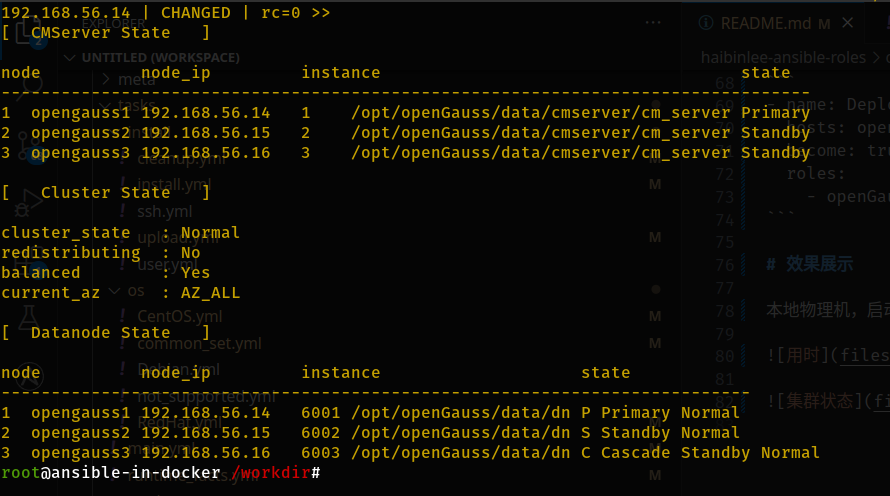

# 开始部署

建议使用前文提到的 Ansible 容器执行部署，避免系统差异、ansible 版本差异等一系列问题造成的运行失败。本项目全部基于 Ansible in Docker 来测试开发。

1. 进入 ansible 环境

    ```
    docker exec -it ansible-for-opengauss byobu
    ```

    关于 byobu 的使用，大家可自行搜索一些教程。在 byobu 里运行的程序或命令，不会因为 SSH 断开而终止。

    基本键盘操作有：

    ```
    F2：新建虚拟终端窗口
    F3：向左切换窗口
    F4：向右切换窗口
    F6：将 byobu 置于后台。后续可以再次执行 `docker exec -it ansible-for-opengauss byobu` 进入。
    ```
    
1. 执行部署

    ```
    pansible 01-deploy.yml
    ```

    这里的 `pansible` 是我预置的命令别名，对应的是 `ansible-playbook`。

1. 部署过程中自动生成的公私钥，以及账号密码，存放在 `ansible-docker/inventories/opengauss/credentials`

    ```
    ls -l ansible-docker/inventories/opengauss/credentials/ 
    total 24
    -rw------- 1 root root  387  9月24日 14:24 openGauss_id_om
    -rw-r--r-- 1 root root   82  9月24日 14:24 openGauss_id_om.pub
    -rw------- 1 root root 3357  9月24日 14:24 openGauss_id_rsa
    -rw-r--r-- 1 root root  726  9月24日 14:24 openGauss_id_rsa.pub
    -rw------- 1 root root   21  9月24日 13:36 openGauss_omm_pass
    -rw------- 1 root root   17  9月24日 13:36 openGauss_root_pass    
    ```

# 顺利部署后，你可看到一下输出内容

## 单节点



对应的 hosts.ini 分组编排内容

```
[openGauss_master]
192.168.56.11

[openGauss_follower]

[openGauss_cascade]

[openGauss:children]
openGauss_master
openGauss_follower
openGauss_cascade
```

## 1 主 1 从



对应的 hosts.ini 分组编排内容

```
[openGauss_master]
192.168.56.12

[openGauss_follower]
192.168.56.13

[openGauss_cascade]

[openGauss:children]
openGauss_master
openGauss_follower
openGauss_cascade
```

## 1 主 1 从 1 级联



对应的 hosts.ini 分组编排内容

```
[openGauss_master]
192.168.56.14

[openGauss_follower]
192.168.56.15

[openGauss_cascade]
192.168.56.16

[openGauss:children]
openGauss_master
openGauss_follower
openGauss_cascade
```

## 1 主 2 从


对应的 hosts.ini 分组编排内容

```
[openGauss_master]
192.168.56.17

[openGauss_follower]
192.168.56.18
192.168.56.19

[openGauss_cascade]

[openGauss:children]
openGauss_master
openGauss_follower
openGauss_cascade
```

## 集群扩容

[扩容](04-expansion.md)