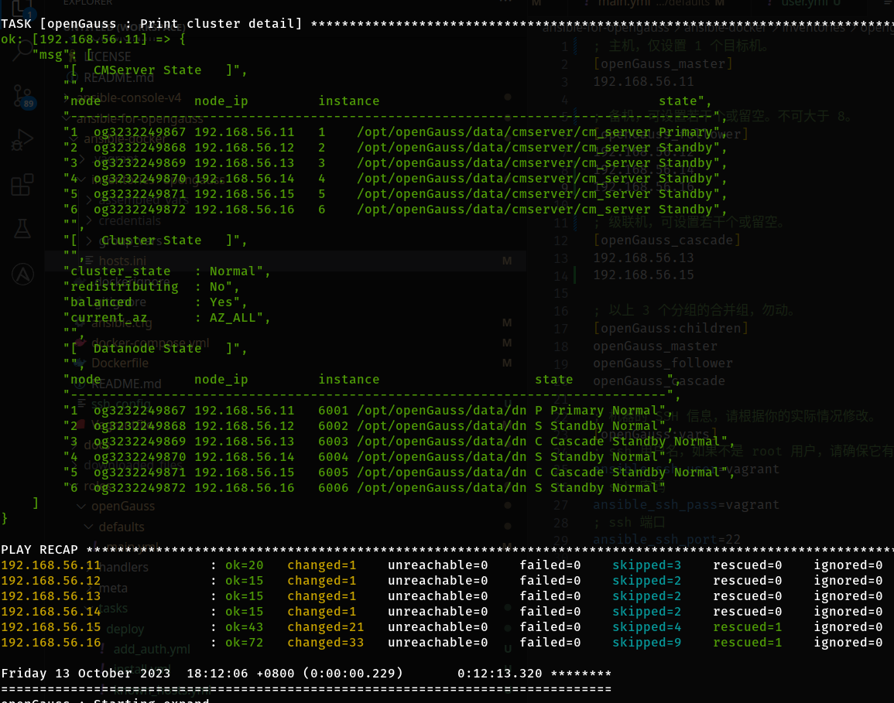

# 集群扩容

*** ！！！注意！！！ ***

*** 扩容有风险，操作前请仔细阅读 https://docs.opengauss.org/zh/docs/5.0.0/docs/ToolandCommandReference/gs_expansion.html ***

*** 仅建议在部署初期，数据量小的情况下，使用本项目进行扩容。 ***

## 修改 `ansible-docker\inventories\opengauss\hosts.ini` 文件

假设原编排为 1 主 1 备 1 级联。

```
; 主服务器组，仅设置 1 个目标机。
[openGauss_master]
192.168.56.11

; 从服务器组，可设置若干个或留空。
[openGauss_follower]
192.168.56.12

; 级联服务器组，可设置若干个或留空。
[openGauss_cascade]
192.168.56.13

```

增加 2 台备机，1 台级联机，则在对应的组里增加目标服务器。

```
; 主服务器组，仅设置 1 个目标机。
[openGauss_master]
192.168.56.11

; 从服务器组，可设置若干个或留空。
[openGauss_follower]
192.168.56.12
192.168.56.14
192.168.56.16

; 级联服务器组，可设置若干个或留空。
[openGauss_cascade]
192.168.56.13
192.168.56.15

```

## 扩容

再次执行 `pansible 01-deploy.yml`。

