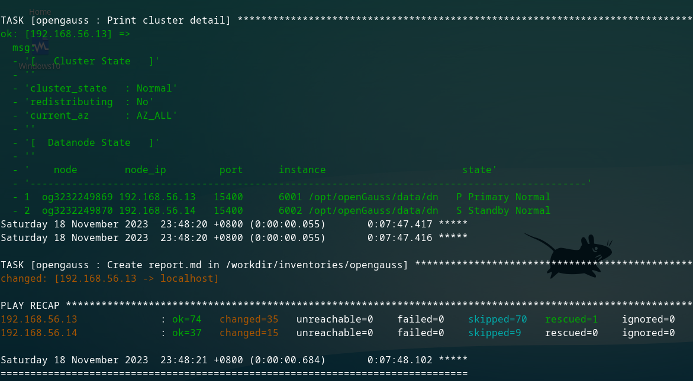
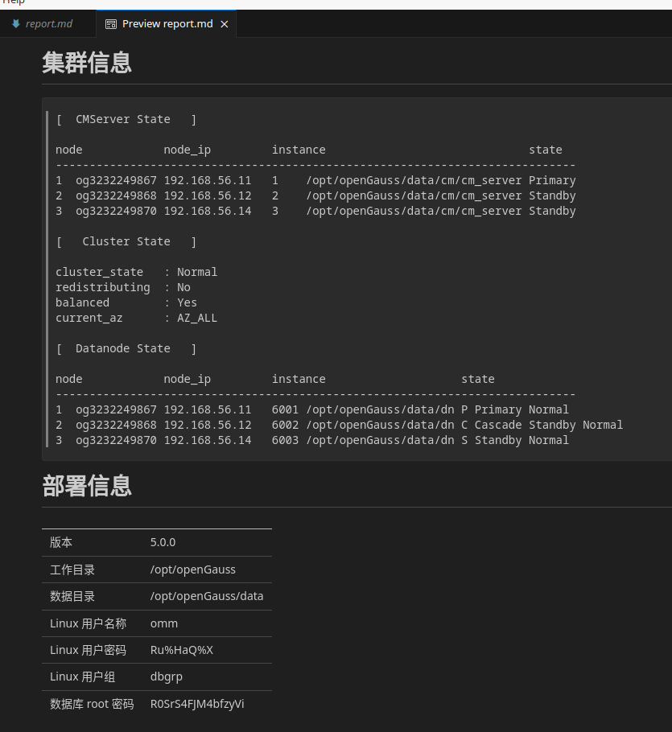

大家好，今天我们为大家推荐一套基于 Ansible 开发的，自动化部署及扩容 openGauss 的脚本工具：Ansible for openGauss（以下简称 AFO）。

通过它，我们只需简单修改一些配置文件，即可快速部署多种架构模式的 openGauss，以及对已有架构进行自动化扩容。下面我们就请这套工具的贡献者，上海联空网络技术有限公司（以下简称“联空网络”）的李海滨，给大家讲解它的设计理念和优点。

# 开发背景

Hi，大家好，我是来自联空网络品质安全中心的运维工程师，李海滨。

我们联空网络是一家专注于互联网医疗领域的公司，国内多家百强医院都是我们公司的客户。面对当前国产信创的需求日益增长，我们的医院客户开始关注我们联空的软硬件产品，是否能与国产新创产品适配。为此我们积极响应，投入专业团队，对相关新创软硬件做可行性研判。

在深入了解国产数据库的过程中，我们接触到了其中一款产品：海量数据库。在向海量数据的工程师们请教后，得知它的上游是开源数据库 openGauss。openGauss是一款开源的关系型数据库管理系统，具有高性能、高可用性以及卓越的扩展能力。于是我构想，我们可以为研发团队提供 openGauss 环境，让他们基于 openGauss 做代码适配。那么我们的软件不就可以同样适配海量数据库咯。

为了方便反复部署测试，我拿出了擅长的 Ansible，为 openGauss 写一套自动化部署工具，以简化其安装、配置和管理过程。

# 解决部署痛点

如果你有过按照官方文档去部署一套 openGauss，你会发现不论是单点还是集群，其实还需要做不少的前期工作。例如要根据 CPU 和操作系统，下载对应版本的安装包。又需要根据不同的 Linux 操作系统，做一些额外配置。手工部署在这里不仅低效，而且容易有错漏。如果是多节点的部署，手工部署的弱势会被进一步放大。

我开发这套 Ansible 脚本的目标，就是尽可能地覆盖部署前、部署中和部署后的场景，并且把手工部署过程中遇到的一些坑，也通过自动化来解决掉。

例如在 openEuler 20.03 系统里部署 openGauss 5.0，你会遇到 readline-devel 这个依赖包的版本是 8，而 openGauss 5.0 需要的是 libreadline.so.7，从而出现报错。我查找到解决方法后，加入到部署流程中，自动帮大家把这个坑给填了。

总结下来，目前我们这个工具能实现以下功能：

1. 提供一个专属的 ansible-docker 目录，只要控制机可运行 docker，即可运行一个 Ansible 容器，适配 AFO 的执行。
1. 自动适配 CPU 架构和操作系统（已支持 CentOS 和 openEuler 20.03），自动下载对应的 openGauss 安装包，自动对操作系统做适配修改。
1. 实现从单节点到多节点的多种架构模式的一次性部署。
1. 使用本工具部署的单点或集群，还能通过添加服务器，再次运行实现平滑扩容。实测可直接从单主扩容到 1 主 2 备 2 级联。
1. 允许用户自定义一些变量，例如指定部署目录，指定 openGauss 版本（5.0 或以上），指定 sysctl 的参数配置。
1. 免除手工部署中的问答环节，自动生成相关密码，自动填写。最后生成部署报告。

# 效率是如何提升的？

#### 以配置网卡 MTU 为例，3 台服务器的执行时间如下：

```
Saturday 18 November 2023  20:54:50 +0800 (0:00:06.777)       0:01:03.288 ***** 

TASK [opengauss : Config MTU in /etc/sysconfig/network-scripts/ifcfg-enp0s8] *****************************************************************************************************************
changed: [192.168.56.11]
changed: [192.168.56.14]
changed: [192.168.56.15]
Saturday 18 November 2023  20:54:50 +0800 (0:00:00.517)       0:01:03.807 ***** 
```

上一个任务的结束时间是 1 分 3 秒 288，Ansible 在不到 0.6 秒的时间里完成了 3 台服务器的网卡 MTU 修改。因为，它是并行操作的。

#### 以生成 cluster_config.xml 为例

3 台服务器的节点，手工写 cluster_config.xml，需要花费多少时间，各位可以自己计时看看。

而我们利用 Ansible 的模板功能，可以在 1 秒内生成该文件，编排非常清晰，一目了然。

从这么一个服务器分组编排文件 `inventories/opengauss/hosts.ini`

```
[opengauss_primary]
192.168.56.11

; 备机，可设置若干个或留空。
[opengauss_standby]
192.168.56.15

; 级联机，可设置若干个或留空。前提是 opengauss_standby 组不为空。
[opengauss_cascade]
192.168.56.14

; 以上 3 个分组的合并组，勿动。
[opengauss:children]
opengauss_primary
opengauss_standby
opengauss_cascade

; 备节点分组，总数不可大于 8。
[opengauss_replicas:children]
opengauss_standby
opengauss_cascade

; 机器的 SSH 信息，请根据你的实际情况修改。
[opengauss:vars]
; ssh 用户名，如果不是 root 用户，请确保它有 sudo 权限。
ansible_ssh_user=vagrant
; ssh 密码
ansible_ssh_pass=vagrant
; ssh 端口
ansible_ssh_port=22

```

生成以下配置内容，仅需 1 秒钟。

```
<?xml version="1.0" encoding="utf-8"?>
<ROOT>
  <CLUSTER>
    <PARAM name="clusterName" value="openGauss" />
    <PARAM name="gaussdbAppPath" value="/opt/openGauss/install/app" />
    <PARAM name="gaussdbLogPath" value="/var/log" />
    <PARAM name="tmpMppdbPath" value="/opt/openGauss/tmp"/>
    <PARAM name="gaussdbToolPath" value="/opt/openGauss/install/om" />
    <PARAM name="corePath" value="/opt/openGauss/corefile"/>
    <PARAM name="nodeNames" value="og3232249867
      ,og3232249870
      ,og3232249871
    "/>
    <PARAM name="backIp1s" value="192.168.56.11
      ,192.168.56.14
      ,192.168.56.15
    "/>
  </CLUSTER>

  <DEVICELIST>

    <!-- CLUSTER PRIMARY -->
    <DEVICE sn="og3232249867">
      <PARAM name="name" value="og3232249867"/>
      <PARAM name="instanceId" value="3232249867"/>
      <PARAM name="azName" value="AZ1"/>
      <PARAM name="azPriority" value="1"/>
      <PARAM name="backIp1" value="192.168.56.11"/>
      <PARAM name="sshIp1" value="192.168.56.11"/>

      <!-- Data Node -->
      <PARAM name="dataNum" value="1"/>
      <PARAM name="dataPortBase" value="15400"/>
      <PARAM name="dataNode1" value="/opt/openGauss/data/dn
        ,og3232249870,/opt/openGauss/data/dn
        ,og3232249871,/opt/openGauss/data/dn
      "/>
      <PARAM name="dataNode1_syncNum" value="0"/>

      <!-- CLUSTER MANAGER -->
      <PARAM name="cmsNum" value="1"/>
      <PARAM name="cmServerPortBase" value="15300"/>
      <PARAM name="cmServerlevel" value="1"/>
      <PARAM name="cmDir" value="/opt/openGauss/data/cm"/>
      <PARAM name="cmServerRelation" value="og3232249867
        ,og3232249870
        ,og3232249871
      "/>
      <PARAM name="cmServerListenIp1" value="192.168.56.11
        ,192.168.56.14
        ,192.168.56.15
      "/>
      <PARAM name="cmServerHaIp1" value="192.168.56.11
        ,192.168.56.14
        ,192.168.56.15
      "/>
    </DEVICE>
    <DEVICE sn="og3232249870">
      <PARAM name="name" value="og3232249870"/>
      <PARAM name="azName" value="AZ1"/>
      <PARAM name="azPriority" value="1"/>
      <PARAM name="backIp1" value="192.168.56.14"/>
      <PARAM name="sshIp1" value="192.168.56.14"/>

      <!-- CLUSTER MANAGER -->
      <PARAM name="cmServerPortStandby" value="15800"/>
      <PARAM name="cmDir" value="/opt/openGauss/data/cm"/>

      <!-- CASCADE ROLE -->
      <PARAM name="cascadeRole" value="on"/>
    </DEVICE>

    <DEVICE sn="og3232249871">
      <PARAM name="name" value="og3232249871"/>
      <PARAM name="azName" value="AZ1"/>
      <PARAM name="azPriority" value="1"/>
      <PARAM name="backIp1" value="192.168.56.15"/>
      <PARAM name="sshIp1" value="192.168.56.15"/>

      <!-- CLUSTER MANAGER -->
      <PARAM name="cmServerPortStandby" value="15800"/>
      <PARAM name="cmDir" value="/opt/openGauss/data/cm"/>

    </DEVICE>


  </DEVICELIST>
</ROOT>
```

我们甚至考虑到了在机房里使用小尺寸显示器查看 cluster_config.xml 的场景，对 xml 做了换行处理，避免出现单行过长的问题。

# 自动化思路

AFO 主要的工作流如下：

1. 对部署环境的信息进行采集。
1. 将用户自定义的变量和脚本默认变量合并，优先使用自定义变量。
1. 检查是否已部署 openGauss，如无，进入初次部署流程。
1. 如果已部署 openGauss，则检查用户是否有添加新节点，进入节点扩容流程。
1. 节点扩容流程里又分 2 步，先扩容备机节点，再扩容级联节点。因为级联节点只连接备机。
1. 如果集群节点数量为 3 或以上，且未部署 CM，则进入 CM 部署流程。
1. 最后，检查确认集群已正常运行，生成部署报告。

# 结果展示

以 5 台 VirtualBox 虚拟机为例，统一 8U+16GB 配置，都在 1 块物理 SATA 盘上读写。

另外，虚拟机都已经提前安装好相关依赖包，openGauss 安装包也已经下载到本地。排除网络下载速度的不确定因素。


#### 单节点，4 分 40 秒（下图右下角）完成部署。


#### 1 主 1 备 1 级联，11 分 07 秒（下图右下角）完成部署。



#### 从 1 主，扩容为 1 主 1 备 1 级联，23 分（下图右下角）完成部署。

扩容模式需要额外的流程，因此耗时比直接部署 3 节点的要多。


最后生成部署报告



# 项目 git 库地址

这套工具已经收录在 openGauss 社区的官方代码库，欢迎大家前往下载试用，并向我们多多提出宝贵意见。

### https://gitee.com/opengauss/ansible-for-opengauss

# 后话

上海联空网络科技有限公司，致力于为医疗行业提供全面、高效的互联网解决方案。作为众多知名医院的软件供应商，我们凭借丰富的行业经验和卓越的技术实力，赢得了广泛的客户认可和口碑。

我们的团队由一批经验丰富、技术精湛的专家组成，他们在互联网医疗领域具有深厚的积累和专业的知识。通过不断创新和完善，我们为医院客户提供了一系列优质、高效的软件服务，帮助医疗机构实现数字化转型和信息化升级，提高医疗质量和效率。

未来，我们也将继续投入更多资源，为 openGauss 等开源技术贡献力量，同时为医疗行业提供更多创新、高效的解决方案，推动互联网医疗的进一步发展。感谢您的关注和支持，期待与您共同探讨互联网医疗的未来发展。